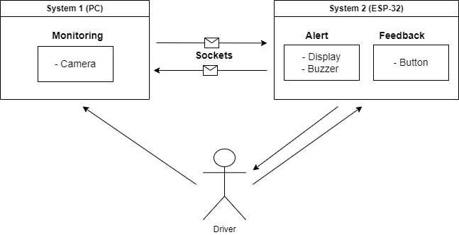
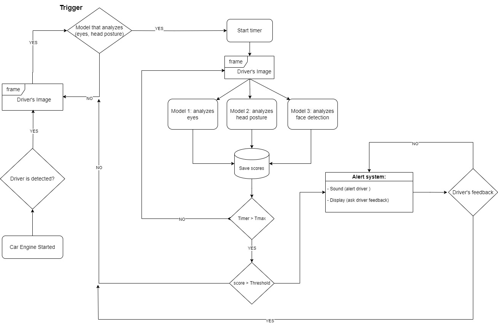

# Driver's Attention Monitoring System
Since accidents have been one of the factors that cause the most deaths in world the main objective of this project is to develop a system that monitors the driver and that through artificial intelligence models can predict when this is showing signs of tiredness, and can also quickly notify and ask for something feedback, thus avoiding accidents due to distraction and possible deaths. With this system it is possible to help reduce this problem, and make driving safer.

## Hardware:
PiezoBuzzer;
* TFT Display 1.8;
* Button;
* ESP32 microcontroller;
* Camera;
* Computer.

## Software:
The `trigger()` function is a function developed to make a quick analysis of the driver's condition to look for signs of drowsiness and inattention before in-depth analysis, and is intended to be composed of two models, which have good generalization capacity. The `analyze()` function is a more robust function that is only executed if the trigger function is activated, this function analyzes with more time and more models (3) `deepface`, `eyes.pt` and `head.pt`, which analyze the driver's condition.

## To run the project, follow the steps below:

#### 1- Create a virtual environment for the project's dependencies:
```python
python -m venv <environment-name>
```
#### 2- Ativacte the virtual environment:
```python
<environment-name>\Scripts\Activate.ps1
```
#### 3- Install the packages on the requirements.txt:
```python
pip install -r requirements.txt
```
#### 4- Install PlatformIo:
Install PlatformIo in vscode on the extension icon, see more:https://docs.platformio.org/en/latest/integration/ide/vscode.html

## Usage
Just run the sript `Monitoring_system.py` and the `main.cpp` contained in Alert_System in `PlatformIO` and the after all the steps above, Make sure you have both systems connected to same network as they communicate through `sockets`. 

## Copyright
You are allowed use any part of the software or ideas found on this repository for anything. I only kindly ask that you give us credit if you use anything from here on a tutorial, project, example, etc...
